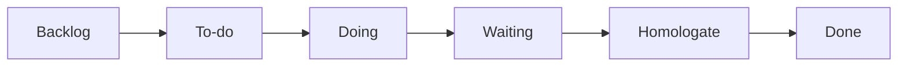

# Escrevendo páginas do Guia Azure DevOps (mkdocs-material)

O site é gerado pelo `mkdocs-material` a partir do `mkdocs.yml` na raiz. A navegação fica na chave `nav` do próprio `mkdocs.yml`. O leitor vê um site com tema e recursos em JavaScript, não o Markdown cru do repositório: escreva para esse formato.

Leia também o `AGENTS.md` na raiz, que traz as regras de conteúdo, o tom de voz e o exemplo contínuo.

Referências:
- mkdocs-material: https://squidfunk.github.io/mkdocs-material/reference/

## Regras obrigatórias

1. **Nunca cite o nome da empresa**, unidades de negócio ou frases de reforço do brand book. Use "a organização", "a equipe", "corporativo".
2. **Nunca escreva um sumário manual.** O sumário lateral é gerado a partir dos títulos (`toc` + `toc.follow`).
3. **Nunca use blockquote `>` para notas, avisos ou dicas.** Use admonitions. Citações reais de pessoas ou especificações podem continuar com `>`.
4. **Não adicione listas de navegação** ("veja também página X / Y") no fim das páginas. Referências cruzadas dentro do texto são permitidas.
5. **Não mova páginas existentes sem necessidade.** A URL deriva do caminho do arquivo. Ao renomear, atualize todos os links internos.
6. **Páginas novas entram no `nav` do `mkdocs.yml`**, na seção adequada.
7. **Um `#` por página** (título). Seções usam `##` e abaixo.
8. **Português do Brasil.** Nomes de telas, campos e botões do Azure DevOps ficam em inglês e em negrito (**New project**, **Publish**). Confira os nomes exatos nas skills `azure-boards` e `azure-repos`.

## Tom de voz

- Sério, profissional, objetivo e confiável.
- Frases curtas e diretas, com formalidade moderada.
- Regras e comparações em tabelas e listas.
- Sem exageros, termos genéricos ou promessas vagas. Não use emojis no texto corrido.

## Clareza

O leitor domina dados, mas tem pouca vivência com Git e DevOps. Não mencione isso no texto.

- Explique cada termo de Git ou de fluxo em uma frase na primeira ocorrência da página (squash, rebase, hook, branch policy).
- Termos recorrentes ficam em `includes/abreviacoes.md` e aparecem como tooltip em todas as páginas. Ao usar um termo novo, adicione-o ali.
- Todo comando `git` ou `az` leva anotação `(1)!` dizendo o que faz.
- Detalhe de referência ou de exceção vai em bloco recolhido (`???`).
- Cada regra tem uma página dona. As demais apontam para ela, sem repetir.
- As etapas do board usam o componente `<ol class="trilho">` (veja `docs/azure-devops/index.md`), definido em `brand.css`.

## Admonitions

Habilitadas via `admonition` + `pymdownx.details`.

```markdown
!!! note
    Nota simples. A linha em branco e a indentação de 4 espaços são obrigatórias.

!!! warning "Título personalizado"
    Aviso com título.

??? note "Clique para expandir"
    Recolhido por padrão.

???+ note "Aberto, mas recolhível"
    Conteúdo longo opcional.
```

Tipos: `note`, `abstract`, `info`, `tip`, `success`, `question`, `warning`, `failure`, `danger`, `bug`, `example`, `quote`. Escolha o tipo que corresponde ao conteúdo, sem usar `note` para tudo.

## Blocos de código

Sempre com linguagem. Use `title=` para caminhos de arquivo ou para descrever o bloco:

````markdown
```markdown title=".azuredevops/pull_request_template.md"
## O que foi feito?
```
````

Atributos úteis: `linenums="1"` e `hl_lines="2 4-6"`.

**Anotações de código** (`content.code.annotate`):

````markdown
```bash
az repos pr create --draft --work-items 123  # (1)!
```

1. Vincula o work item `#123` ao pull request.
````

## Abas

Use para "diferentes formas de fazer a mesma coisa". Mantenha os rótulos padrão do site, **"Interface web"** e **"az CLI"**, para que a escolha persista entre páginas (`content.tabs.link`):

````markdown
=== "Interface web"

    1. Página inicial da organização → **New project**.

=== "az CLI"

    ```bash
    az devops project create --name "Dados - MDM" --process "Agile MDM"
    ```
````

## Diagramas

Mermaid está configurado no `pymdownx.superfences`. Prefira Mermaid a ASCII para fluxos, estados e sequências:

````markdown

````

## Outros recursos habilitados

- **Listas de definição** (`def_list`): termo e definição.
- **Abreviações** (`abbr`): `*[WIP]: Work in progress`.
- **Teclas** (`pymdownx.keys`): `++ctrl+k++`.
- **Checklists** (`pymdownx.tasklist`): `- [ ] item`.
- **Ícones** (`pymdownx.emoji`): `:material-rocket:`.
- **Cards**: `<div class="grid cards" markdown>` com lista, como em `docs/index.md`.
- **md_in_html** e **attr_list**: Markdown dentro de `<div markdown>` e atributos `{ .classe }`.

## Navegação (`mkdocs.yml`)

```yaml
nav:
  - Início: index.md
  - Azure DevOps:
      - azure-devops/index.md          # usa o H1 da página como rótulo
      - Work items: azure-devops/work-items.md
```

## Convenções

- Nomes de arquivo em kebab-case, em português, sem acentos (`branches-e-commits.md`).
- Links internos relativos: `[Entregas](entregas.md#planejamento)`. Âncoras são geradas sem acentos (`#definicao-de-pronto`).
- Imagens e ativos ficam em `docs/assets/`.
- Cores e fontes ficam apenas em `docs/assets/stylesheets/brand.css`. Não use estilos inline com cores.

## Ao concluir uma alteração

1. As notas usam admonitions? Não há sumário nem navegação manual?
2. A página nova está no `nav`?
3. Os links internos de arquivos renomeados foram atualizados?
4. Execute `mkdocs build --strict` na raiz. O mesmo comando roda no CI.
5. O nome da empresa não aparece no texto?
6. Para revisão visual, sugira `mkdocs serve` (`http://127.0.0.1:8000`).
