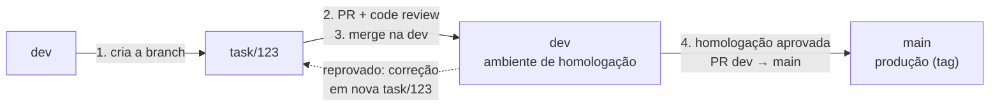

# Branches e commits

A branch conecta o work item ao código. Cada tarefa tem a própria branch, criada a partir da `dev`, que volta para a `dev` por pull request. A `main` recebe apenas o que foi homologado na `dev`.

## Branches

| Branch | Tipo | Origem | Destino | Conteúdo | Ambiente |
| :--- | :--- | :--- | :--- | :--- | :--- |
| `main` | Permanente | — | — | Código homologado | Produção (por tag) |
| `dev` | Permanente | `main` | `main`, por PR | Código revisado, em homologação | Homologação |
| `task/<id>` | Temporária | `dev` | `dev`, por PR | Um work item | Local |

O `<id>` é o ID do work item: a tarefa `#123` usa a branch `task/123`.

## Fluxo de uma tarefa



| Passo | Ação | State do work item |
| :--- | :--- | :--- |
| 1 | Cria `task/123` a partir da `dev` atualizada | **Doing** |
| 2 | Publica o PR `task/123` → `dev` para code review | **Waiting** |
| 3 | PR aprovado e concluído na `dev` | **Homologate** |
| 4 | Homologação aprovada e PR `dev` → `main` concluído | **Done** |

Se a homologação reprovar a mudança, a branch `task/123` já foi excluída no merge. Recrie-a a partir da `dev` para fazer a correção.

### Regras

| Regra | Motivo |
| :--- | :--- |
| Um work item, uma branch `task/<id>`, um pull request | Cada mudança de regra é revisada e homologada isoladamente |
| `task/<id>` nasce sempre da `dev` atualizada | Reduz conflitos com o que já está em homologação |
| Nenhum commit direto na `dev` ou na `main` | Todo código passa por pull request. As [branch policies](pull-requests.md#branch-policies) bloqueiam o push direto |
| A `main` recebe código apenas da `dev` | Nada chega à produção sem passar pela homologação |
| `dev` sempre promovível | Item reprovado na homologação é revertido na `dev` (**Revert** no PR) se a correção não for imediata |
| `task/<id>` excluída após o merge | A lista de branches mostra apenas o trabalho em andamento |

!!! info "Correção urgente"
    Um incidente em produção segue o mesmo fluxo, com **Priority 1**: `task/<id>` a partir da `dev`, code review e homologação imediatos, promoção para a `main` e tag PATCH.

## Criando a branch

=== "Interface web"

    1. No work item, seção **Development**, clique em **Create a branch**.
    2. Informe o nome `task/123`, o repositório `mdm-hub` e a base `dev`. Clique em **Create branch**.
    3. Traga a branch para a máquina local:

        ```bash title="Checkout local"
        git fetch origin
        git switch task/123
        ```

=== "az CLI"

    ```bash title="Branch a partir da dev"
    git fetch origin   # (1)!
    git switch -c task/123 origin/dev   # (2)!
    git push -u origin task/123   # (3)!
    ```

    1. Baixa o estado mais recente do servidor, sem alterar os arquivos locais.
    2. Cria a branch `task/123` a partir da `dev` do servidor e passa a trabalhar nela.
    3. Envia a branch ao Azure Repos. O `-u` liga a branch local à remota: os próximos envios usam apenas `git push`.

    A branch criada pelo terminal é vinculada ao work item pela menção `#123` nos commits e pelo pull request.

Em seguida, atribua o work item a você (**Assigned To**) e mova-o para **Doing**.

## Padrão de commits

Os commits seguem o [Conventional Commits](https://www.conventionalcommits.org/pt-br/v1.0.0/) e são semânticos: o tipo de cada commit diz o que a mudança faz. O padrão torna o histórico legível e permite calcular a versão a partir dos commits. Veja [Versionamento](entregas.md#versionamento).

Padrão: `tipo(escopo): descrição no imperativo`

```text title="Exemplos"
feat(higienizacao): valida dígito verificador de CPF
fix(higienizacao): corrige DV de CNPJ com zeros à esquerda
refactor(matching): extrai comparadores para módulo próprio
docs(sobrevivencia): descreve prioridade de fontes do e-mail
test(matching): cobre caso de gêmeos com mesmo CPF
chore(deps): atualiza Airflow para 3.0.6
ci(infra): publica imagem com tag do commit
feat(ingestao)!: altera layout da view de pessoa
```

A primeira linha é o título. O corpo, separado por uma linha em branco, explica o motivo e referencia o work item:

```text title="Commit completo"
feat(higienizacao): valida dígito verificador de CPF

CPFs com DV incorreto passam a ir para a fila de inválidos.
Efeito esperado: aumento de inválidos nas origens de cadastro manual.

Refs #123
```

| Tipo | Uso | Versão |
| :--- | :--- | :--- |
| `feat` | Nova funcionalidade ou nova regra | MINOR |
| `fix` | Correção de erro | PATCH |
| `refactor` | Mudança interna sem alterar comportamento nem resultado nos dados | — |
| `docs` | Documentação | — |
| `test` | Testes | — |
| `chore` | Build, dependências, configuração | — |
| `ci` | Pipelines | — |

O **escopo** é o último nível do [Area Path](configuracao.md#campos) em minúsculas e sem acentos: `ingestao`, `higienizacao`, `matching`, `sobrevivencia`, `publicacao`, `curadoria`, `orquestracao`, `infra`. Use `deps` para dependências.

!!! warning "Mudanças incompatíveis"
    Adicione `!` após o escopo quando a mudança quebrar um contrato, como o layout das views de ingestão ou o formato publicado aos consumidores. O `!` gera uma versão MAJOR e sinaliza que outras equipes precisam se adaptar.

!!! tip "Boas práticas"
    - Um commit, uma mudança lógica.
    - Descrição curta (até 72 caracteres), no imperativo e em minúsculas.
    - Use o corpo do commit para explicar o **porquê**, não o **como**. Em regras de dados, registre o efeito esperado.
    - Referencie o work item no corpo: `Refs #123`. Com **Commit mention linking** ativo no repositório, a menção vincula o commit ao work item.

!!! warning "Não mude o estado pelo commit"
    Palavras como `Fixes #123` em mensagens de commit podem mudar o estado do work item sem passar pela homologação. Use apenas `Refs #123`.

### Verificações antes do commit

Os repositórios usam [pre-commit](https://pre-commit.com/) para rodar formatação e lint (Ruff) antes de cada commit. O hook é um script que o Git executa sozinho: se a verificação falhar, o commit não é criado. Instale os hooks uma vez, ao clonar o repositório:

```bash title="Instalação dos hooks"
uv run pre-commit install
```

!!! danger "Nunca pule os hooks"
    Não use `git commit --no-verify`, nem aceite essa sugestão de um agente de IA. Se o hook falhar, corrija o que foi apontado.

## Mantendo a branch atualizada

Enquanto a tarefa está em desenvolvimento, outras tarefas entram na `dev`. O rebase reaplica os commits da sua branch sobre a `dev` mais recente, para que o pull request contenha apenas a sua mudança e os conflitos sejam resolvidos antes da revisão.

```bash title="Atualização com a dev"
git fetch origin   # (1)!
git rebase origin/dev   # (2)!
git push --force-with-lease   # (3)!
```

1. Baixa o estado mais recente da `dev`.
2. Reaplica os commits da `task/123` sobre a `dev` atualizada.
3. O rebase reescreve os commits da branch, por isso o envio precisa sobrescrever a versão do servidor. `--force-with-lease` recusa o push se alguém tiver enviado commits à branch que você ainda não tem. O force push é permitido apenas em `task/<id>`, nunca na `dev` ou na `main`.

??? question "O rebase parou com conflito"
    O conflito ocorre quando a sua branch e a `dev` alteraram o mesmo trecho. O Git interrompe o rebase e lista os arquivos afetados.

    1. Abra cada arquivo listado e escolha o conteúdo correto entre os marcadores `<<<<<<<` e `>>>>>>>`.
    2. Marque os arquivos como resolvidos e continue:

        ```bash title="Continuação do rebase"
        git add <arquivo>
        git rebase --continue
        ```

    3. Para desistir e voltar ao estado anterior ao rebase, use `git rebase --abort`.
