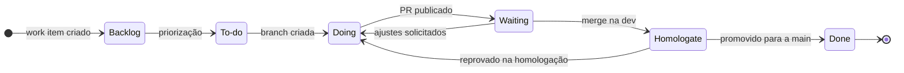

# Visão geral

O projeto no Azure DevOps é **a fonte única da verdade** sobre o andamento do trabalho. Se não está no Azure Boards, não está planejado.

O trabalho é organizado em **entregas**, não em ciclos de tempo fixo. Cada entrega é um work item do tipo **Entrega** com escopo e data alvo, e seus work items filhos percorrem as etapas do board. Veja [Entregas](entregas.md).

## Etapas do board

O campo **State** define as etapas. Os nomes e a ordem são os mesmos em todos os projetos da organização, pois são estados do processo herdado. Veja [Processo](configuracao.md#processo).

| State | Significado | Entra quando | Sai quando |
| :--- | :--- | :--- | :--- |
| **Backlog** | Registrado, ainda não priorizado | O work item é criado | É priorizado para execução |
| **To-do** | Priorizado, pronto para desenvolvimento | Atende à [definição de pronto](work-items.md#definicao-de-pronto) e foi priorizado | Alguém assume e cria a branch |
| **Doing** | Em desenvolvimento | A branch `task/<id>` é criada e há responsável | O pull request para a `dev` é publicado |
| **Waiting** | Aguardando code review | Pull request publicado (**Publish**) | O pull request é aprovado, ou há ajustes solicitados (volta para **Doing**) |
| **Homologate** | Em homologação: validação funcional na `dev` contra os critérios de aceitação | Pull request aprovado e concluído na `dev` | A `dev` é promovida para a `main`, ou é reprovado (volta para **Doing**) |
| **Done** | Homologado e na `main` | Pull request `dev` → `main` concluído | — |

!!! note "Homologação antes da main"
    A tarefa passa pela `dev` antes de chegar à `main`. A homologação ocorre na `dev`, em ambiente de homologação, e a `main` recebe apenas código revisado e homologado. No MDM, isso impede que uma regra não validada altere os Golden Records. Veja [Fluxo de uma tarefa](branches-e-commits.md#fluxo-de-uma-tarefa).
## Princípios

- **Um work item, uma entrega de valor.** Cada work item gera ao menos um pull request e é concluído por ele.
- **Nada fora do board.** Trabalho não registrado não é planejado, medido nem revisado.
- **Status sempre atualizado.** Quem executa a ação move o item.
- **Pequeno e frequente.** Work items e pull requests pequenos reduzem o tempo de revisão, de homologação e o risco de cada entrega. Uma regra de dados por pull request.
- **Fluxo contínuo.** Concluir tem prioridade sobre iniciar. Veja [limites de WIP](entregas.md#limite-de-trabalho-em-andamento).
