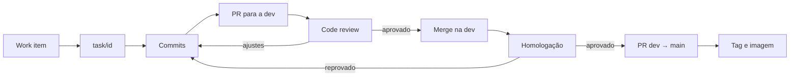

# Fundamentos

Esta página explica **por que** a equipe usa o Azure DevOps da forma definida neste guia. As regras das demais páginas partem daqui.

## DevOps e DataOps

DevOps é uma cultura e um conjunto de práticas que aproxima o desenvolvimento de software da operação dos sistemas. Aplicada a dados, recebe o nome de **DataOps**: as mesmas práticas, com atenção adicional à qualidade e à rastreabilidade dos dados.

| Pilar | Significado | Como aparece neste guia |
| :--- | :--- | :--- |
| **Colaboração** | Objetivos comuns e trabalho visível para todos | Projeto único no Azure DevOps, work items e pull requests visíveis para a equipe |
| **Automação** | Tarefas repetitivas executadas por máquina | Formatação e lint automáticos antes de cada commit (pre-commit) |
| **Medição** | Decisões baseadas em dados do processo | Dashboards do time, métricas de qualidade na homologação |
| **Compartilhamento** | Conhecimento registrado, não individual | Critérios de aceitação, code review, histórico de commits |
| **Segurança** | Proteção desde o início do ciclo | Branch policies, segredos fora do código, dados pessoais fora do repositório |

## Propósito de cada recurso

Cada recurso do Azure DevOps resolve um problema específico. No MDM, o código define como os cadastros são padronizados, unificados e publicados. Por isso, cada mudança precisa ser rastreável até a decisão que a originou.

| Recurso | Propósito | No MDM |
| :--- | :--- | :--- |
| **Repositório (Azure Repos)** | Guarda o código e todo o histórico de alterações. Permite comparar e reverter versões | Regras de higienização, passos de matching, regras de sobrevivência e DAGs do Airflow ficam versionados |
| **Work item** | Registra uma demanda com contexto e critérios de aceitação | Documenta o motivo de uma mudança de regra: qual problema de cadastro ela resolve |
| **Azure Boards** | Mostra o andamento de todos os work items em um só lugar, no board, no backlog e nas queries | Visão das entregas do Hub MDM e do que está em revisão ou homologação |
| **Branch** | Isola uma mudança sem afetar o código principal | Uma nova regra é testada sem alterar a carga que está em produção |
| **Commit** | Registra uma alteração pequena, com mensagem padronizada | O histórico mostra quando e por que uma nota de corte mudou |
| **Pull request** | Propõe a integração de uma branch e concentra a revisão | Espaço para discutir o impacto da regra nos Golden Records antes do merge |
| **Tag** | Marca uma versão publicada | Identifica qual versão das regras gerou cada carga |

!!! info "Referência"
    Os conceitos de DevOps, colaboração e integração contínua seguem o material [Fundamentos de DevOps](https://eduardo-da-silva.github.io/fundamentos-devops/).

## O que muda em um projeto de MDM

Em uma aplicação comum, um erro costuma afetar uma tela ou uma funcionalidade. No MDM, uma regra errada altera os **Golden Records de toda a base** e se propaga para todos os sistemas que os consomem. Corrigir exige reprocessar a carga e, em alguns casos, desfazer unificações.

| Tipo de mudança | Risco | Cuidado exigido |
| :--- | :--- | :--- |
| Nota de corte ou passo de **matching** | Falso positivo (pessoas diferentes unificadas) ou falso negativo (mesma pessoa separada) | Testes com casos conhecidos e comparação de métricas na homologação |
| Regra de **sobrevivência** | A ordem das regras muda o valor que sobrevive | Testes por grupo de duplicados e aprovação do responsável pelo domínio |
| Regra de **higienização** | Registros válidos enviados para a fila de inválidos, ou o contrário | Teste de regressão para cada correção |
| Layout das **views de ingestão** | Quebra o contrato com os sistemas de origem | Mudança incompatível: commit com `!` e comunicação às origens |
| **DAG** do Airflow | Janela de dados errada ou reprocessamento que duplica registros | Tasks idempotentes e revisão do agendamento |
| **Imagem** Docker | Versão incerta em produção | Tag fixa (hash do commit ou versão), nunca `latest` |

Esses riscos explicam três regras centrais do guia:

- **Homologação antes da main.** A tarefa passa pela `dev`, onde é homologada com dados representativos. A `main` recebe apenas regras validadas. Veja [Homologação](azure-devops/pull-requests.md#homologacao).
- **Pull requests pequenos.** Uma regra por pull request. Assim é possível medir o efeito de cada mudança isoladamente.
- **Teste para cada bug.** Todo erro de regra corrigido ganha um teste de regressão, para não voltar.

## Estratégia de branches

A equipe adota um modelo simples, com duas branches permanentes e uma branch curta por tarefa:

| Branch | Papel |
| :--- | :--- |
| `main` | Código homologado. Origem das versões em produção |
| `dev` | Integração e homologação. Recebe as tarefas revisadas |
| `task/<id>` | Uma por work item. Nasce da `dev` e volta para ela por pull request |

| Estratégia | Por que não é o padrão |
| :--- | :--- |
| **GitFlow** (`develop`, `release/`, `hotfix/`) | Mais branches para sincronizar. A `dev` já cumpre o papel de homologação |
| **Trunk-based** | Integração direta na principal, sem uma etapa de homologação antes da produção |

O fluxo completo está em [Fluxo de uma tarefa](azure-devops/branches-e-commits.md#fluxo-de-uma-tarefa).
## Dados pessoais

O MDM trata dados pessoais protegidos pela LGPD. O repositório e o Azure Boards são lidos por toda a equipe e guardam o histórico para sempre.

!!! danger "Nunca registre dados reais no Azure DevOps"
    CPF, CNPJ, nomes, endereços, telefones e e-mails reais não entram em work items, comentários, anexos, pull requests, commits, testes ou logs anexados. Use dados sintéticos ou mascarados (ex.: `***.456.789-**`). Credenciais ficam em um cofre de segredos (ex.: Azure Key Vault) ou em `.env` fora do Git.

## Ciclo completo

