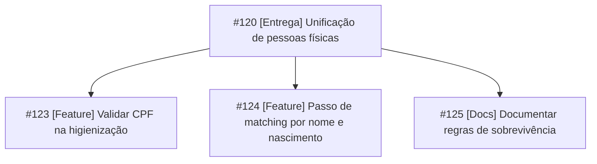

# Entregas

O trabalho é organizado por **entregas**, sem ciclos de tempo fixo. Uma entrega é um incremento de valor com escopo fechado e data alvo, composto por tarefas que avançam no quadro em fluxo contínuo.

## Estrutura

Cada entrega é uma **issue-mãe** com a label `entrega`. As tarefas são **sub-issues** dela.



| Elemento | Regra |
| :--- | :--- |
| Título | `[Entrega] Nome da entrega` |
| Label | `entrega` |
| Campos | **Início**, **Data alvo** e **Prioridade** |
| Descrição | Objetivo, escopo, fora de escopo e critérios de aceitação da entrega. Em MDM, inclua ao menos um critério mensurável de qualidade de dados |
| Sub-issues | Tarefas de tamanho **L** ou menor, de qualquer repositório vinculado |
| Status | Acompanha o estado das sub-issues. Fechada quando todas estiverem em **Done** |

!!! warning "A entrega não recebe código"
    A issue de entrega não tem branch nem pull request próprios. Todo código é vinculado às sub-issues.

```markdown title="Modelo de issue de entrega"
## Objetivo

Reduzir cadastros duplicados de pessoa física entre os sistemas de origem.

## Escopo

- Validação de CPF na higienização
- Novo passo de matching por nome e data de nascimento
- Documentação das regras de sobrevivência

## Fora de escopo

- Pessoa jurídica
- Alteração do layout das views de ingestão

## Critérios de aceitação da entrega

- [ ] CPFs inválidos são direcionados à fila de inválidos
- [ ] Taxa de duplicidade medida antes e depois, na base de homologação
- [ ] Nenhum falso positivo nos casos de teste conhecidos
- [ ] Regras documentadas
```

## Planejamento

1. Crie a issue de entrega e preencha objetivo, escopo e critérios.
2. Quebre o escopo em sub-issues que atendam à [definição de pronto](issues.md#definicao-de-pronto).
3. Estime o **Tamanho** de cada sub-issue.
4. Defina **Início** e **Data alvo** com base no tamanho total e na capacidade disponível.
5. Priorize as sub-issues e mova para **To-do** as que podem ser iniciadas.

!!! tip "Entregas pequenas"
    Prefira entregas de até quatro semanas. Entregas maiores devem ser divididas em entregas incrementais, cada uma com valor próprio.

## Acompanhamento

A view **Entregas** mostra o progresso de cada entrega pelo campo **Sub-issues progress**. Revise o quadro regularmente, da direita para a esquerda:

1. **Homologate**: há itens aguardando homologação?
2. **Waiting**: há pull requests aguardando revisão há mais de um dia útil?
3. **Doing**: há itens parados ou com impedimento?
4. **To-do**: qual o próximo item prioritário?

!!! info "Risco na data alvo"
    Se o progresso indicar risco para a **Data alvo**, reduza o escopo (mova sub-issues para uma próxima entrega) ou renegocie a data. Registre a decisão em comentário na issue de entrega.

## Limite de trabalho em andamento

| Coluna | Limite de referência |
| :--- | :--- |
| **Doing** | Um item por desenvolvedor |
| **Waiting** | Metade do número de desenvolvedores |
| **Homologate** | Definido conforme a disponibilidade para homologar |

Com um limite atingido, a prioridade é revisar, homologar e concluir, não iniciar novos itens.

| Sintoma no quadro | Ação |
| :--- | :--- |
| **Waiting** acumulando | Priorizar code review antes de novos itens |
| **Homologate** acumulando | Agendar homologação em bloco |
| Item em **Doing** há muitos dias | Dividir a issue ou pedir apoio |
| Retornos frequentes de **Homologate** para **Doing** | Revisar a qualidade dos critérios de aceitação e dos casos de teste |

## Fechamento

A entrega é concluída quando:

- [ ] Todas as sub-issues estão em **Done**.
- [ ] Os critérios de aceitação da entrega foram validados.
- [ ] A versão foi publicada (tag, release e imagem).

Feche a issue de entrega como **Completed**. Itens de escopo não concluídos são movidos para uma nova entrega antes do fechamento.

### Versionamento

Cada entrega publicada gera uma **release** no GitHub, com tag no padrão [SemVer](https://semver.org/lang/pt-BR/) `vMAJOR.MINOR.PATCH`. O tipo dos commits indica qual número sobe:

| Commits na entrega | Versão | Exemplo |
| :--- | :--- | :--- |
| Só `fix` | PATCH | `v1.4.0` → `v1.4.1` |
| Ao menos um `feat` | MINOR | `v1.4.0` → `v1.5.0` |
| Mudança incompatível (`!`), como novo layout das views de ingestão | MAJOR | `v1.4.0` → `v2.0.0` |

- Referencie a issue de entrega na descrição da release. As notas geradas automaticamente listam os pull requests incluídos.
- A imagem Docker publicada recebe a mesma versão e o hash do commit (ex.: `mdm-airflow:1.5.0` e `mdm-airflow:a1b2c3d`).
- Produção sempre usa uma tag fixa. `latest` não identifica qual código está em execução.

!!! tip "Rastreabilidade da carga"
    Registre a versão da aplicação nos metadados de execução da carga. Assim é possível saber qual versão das regras gerou cada Golden Record.

## Insights

Mantenha os seguintes gráficos em **Insights**:

| Gráfico | Configuração | Pergunta que responde |
| :--- | :--- | :--- |
| **Itens por status** | Barras, eixo X = Status, filtro `-label:entrega -status:Done` | Em qual etapa o trabalho está parado? |
| **Itens por entrega** | Barras empilhadas, eixo X = Parent issue, agrupar por Status | Qual entrega está atrasada? |
| **Itens por responsável** | Barras, eixo X = Assignees, filtro `-status:Done` | A carga está equilibrada? |
| **Vazão** | Histórico, filtro `-label:entrega` | O ritmo de conclusão é estável? |

!!! info "Métricas são da equipe"
    Os gráficos avaliam o fluxo de trabalho, não o desempenho individual.
