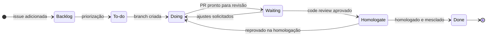

# Visão geral

O Project é **a fonte única da verdade** sobre o andamento do trabalho. Se não está no Project, não está planejado.

O trabalho é organizado em **entregas**, não em ciclos de tempo fixo. Cada entrega é uma issue-mãe com escopo e data alvo, e suas sub-issues percorrem as etapas do quadro. Veja [Entregas](entregas.md).

## Etapas do quadro

O campo **Status** define as etapas. Os nomes e a ordem são os mesmos em todos os Projects da organização.

| Status | Significado | Entra quando | Sai quando |
| :--- | :--- | :--- | :--- |
| **Backlog** | Registrado, ainda não priorizado | A issue é adicionada ao Project | É priorizada para execução |
| **To-do** | Priorizado, pronto para desenvolvimento | Atende à [definição de pronto](issues.md#definicao-de-pronto) e foi priorizado | Alguém assume e cria a branch |
| **Doing** | Em desenvolvimento | A branch é criada e há responsável | O pull request fica pronto para revisão |
| **Waiting** | Aguardando code review | Pull request marcado como **Ready for review** | O pull request é aprovado, ou há ajustes solicitados (volta para **Doing**) |
| **Homologate** | Em homologação: validação funcional contra os critérios de aceitação | Pull request aprovado no code review | É homologado e o merge é feito, ou é reprovado (volta para **Doing**) |
| **Done** | Homologado e entregue | Pull request mesclado e issue fechada | — |

## Movimentação do status

O status é atualizado manualmente, por quem executa a ação:

| Transição | Quem move | Quando |
| :--- | :--- | :--- |
| Backlog → To-do | Quem prioriza a entrega | A issue atende à definição de pronto |
| To-do → Doing | Desenvolvedor | Ao criar a branch |
| Doing → Waiting | Desenvolvedor | Ao marcar o PR como **Ready for review** |
| Waiting → Doing | Desenvolvedor | Ao receber **Request changes** |
| Waiting → Homologate | Revisor | Ao aprovar o PR |
| Homologate → Doing | Responsável pela homologação | Ao reprovar, com o motivo em comentário |
| Homologate → Done | Quem faz o merge | Após o merge |

!!! warning "Status é compromisso"
    **Doing** significa trabalho ativo agora. Se o item parou, volte-o para **To-do** e registre o motivo na issue.

!!! info "Waiting não é bloqueio"
    **Waiting** indica exclusivamente que o item aguarda code review. Impedimentos externos não mudam o status: registre-os na issue e marque a dependência em **Relationships** → **Mark as blocked by**.

!!! note "Homologação antes do merge"
    A homologação ocorre **antes do merge** na `main`, em ambiente de homologação, com a versão do pull request. A `main` recebe apenas código revisado e homologado, e o fechamento da issue pelo merge coincide com a conclusão real do item. No MDM, isso impede que uma regra não validada altere os Golden Records. Veja [Fundamentos](../fundamentos.md#o-que-muda-em-um-projeto-de-mdm).

## Princípios

- **Uma issue, uma entrega de valor.** Cada issue gera ao menos um pull request e é fechada por ele.
- **Nada fora do quadro.** Trabalho não registrado não é planejado, medido nem revisado.
- **Status sempre atualizado.** Quem executa a ação move o item. Veja [Movimentação do status](#movimentacao-do-status).
- **Pequeno e frequente.** Issues e pull requests pequenos reduzem o tempo de revisão, de homologação e o risco de cada entrega. Uma regra de dados por pull request.
- **Fluxo contínuo.** Concluir tem prioridade sobre iniciar. Veja [limites de WIP](entregas.md#limite-de-trabalho-em-andamento).
